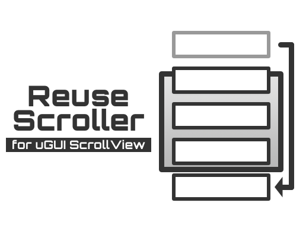

## Download

[ReuseScroller - Asset Store](https://www.assetstore.unity3d.com/#!/content/106279)

## Usage

### 1. Model: Define item format

```c-sharp
public struct ExampleItem {
    public string name;
}
```

### 2. View: Inherit BaseCell

```c-sharp
public class ExampleCell : ReuseScroller.BaseCell<ExampleItem>
{
    public Text label;

    public override void UpdateContent(ExampleItem item) {
    label.text = item.name;
    }
}
```

Add the script as component to GameObject, e.g. uGUI Button.

### 3. Controller: Inherit BaseController

```c-sharp
public class ExampleController : ReuseScroller.BaseController<ExampleItem>
{
    protected override void Start() {
        base.Start();
        var items = new List<ExampleItem>();
        for (int i=1; i<=20; i++) {
            items.Add(new ExampleItem { name=i.ToString("d") });
        }
        CellData = items;
    }
}
```

Add the script as component to uGUI ScrollView.

## Inspector

* Scroll Direction (Direction)
* Scroll Reverse (bool)
* Cell Object (GameObject)
* Default Cell Size (float)
* Spacing (float)
* Content Padding (RectOffset)
* Active Padding (float)

## Test

Supported Unity Test Runner (Play Mode).

## License

The script is available as open source under the terms of the [MIT License](http://opensource.org/licenses/MIT).
